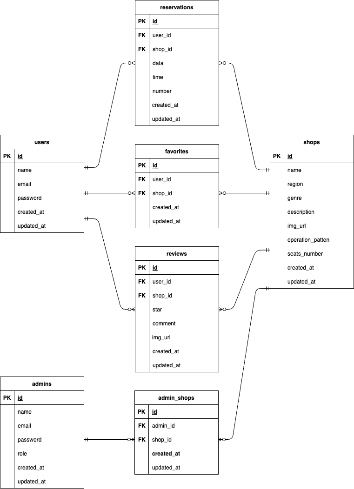

# Rese（飲食店予約アプリ）

飲食店予約アプリ  


## 作成した目的

Webアプリ開発の勉強のため

## アプリケーション URL

- 開発(ローカル)環境  http://localhost
- phpMyAdmin：http://localhost:8080/
- Mailhog  http://localhost:8025/

## 機能一覧

- 会員登録機能
- ログイン機能
- ログアウト機能
- メール認証
- 検索機能
- 店舗詳細表示
- 予約
- マイページ
- 予約変更・キャンセル
- QRコード表示
- お気に入り登録・解除
- 管理者・店舗代表者のログイン
- 管理者・店舗代表者一覧表示
- 管理者・店舗代表者の登録
- お知らせメール送信
- 店舗情報の更新・作成
- 予約一覧表示
- 評価機能

## 仕様技術

- PHP7.4.9
- Laravel8.83.8
- MySQL8.0.26
- Nginx1.21.1
- Docker/Docker-compose

## テーブル設計


## ER 図



## 環境構築

###  **Docker ビルド**

1. `git@github.com:Shinji-0323/Rese.git`
2. DockerDesktop アプリを立ち上げる
3. `docker-compose up -d --build`

###  **Laravel 環境構築**

1. `docker-compose exec php bash`
2. `composer install`
3. 「.env.example」ファイルを 「.env」ファイルに命名を変更。または、新しく.env ファイルを作成
4. .env に以下の環境変数を追加

```text
DB_CONNECTION=mysql
DB_HOST=mysql
DB_PORT=3306
DB_DATABASE=laravel_db
DB_USERNAME=laravel_user
DB_PASSWORD=laravel_pass
```

5. アプリケーションキーの作成

```bash
php artisan key:generate
```

6. マイグレーションの実行

```bash
php artisan migrate
```

7. シーディングの実行

```bash
php artisan db:seed
```

## メール認証の環境構築

このアプリケーションでは、**管理者用メール認証をカスタマイズ**しています。以下の手順に従って環境を構築してください。

### **Mailhogの設定**

1. Dockerコンテナをビルドする際、Mailhogが自動的に起動します。
- Mailhogは `http://localhost:8025/` でアクセス可能です。

2. Laravelの `.env` ファイルにメール送信の設定を記載します。

```text
MAIL_MAILER=smtp
MAIL_HOST=mailhog
MAIL_PORT=1025
MAIL_USERNAME=null
MAIL_PASSWORD=null
MAIL_ENCRYPTION=null
MAIL_FROM_ADDRESS=example@example.com
MAIL_FROM_NAME="${APP_NAME}"
```
### **カスタムメール認証の概要**
このアプリケーションでは、Laravelの標準的なメール認証を拡張し、管理者専用のカスタム認証フローを実装しています。

1. #### カスタムメール通知
- クラス： `App\Notifications\AdminVerifyEmailNotification`
- 管理者用の署名付きメール確認リンクを生成します。

2. #### ルーティング
- 認証用ルートは `routes/admin.php` に定義されています。
- 主なルート：
  - 確認メールの送信: `/email/verification-notification` (`POST`)
  - 確認メールのリンク処理: `/email/verify/{id}/{hash}` (`GET`)
  - 確認未完了の画面表示: `/email/verify` (`GET`)

3. #### メールビュー
- 未確認メールの再送信画面： `resources/views/admin/verified.blade.php`
- 確認メール再送信機能が含まれています。

### **メール認証機能の動作確認**

1. #### メール確認
- 管理者登録またはログイン時に、メール認証が求められます。
-  登録後、 `http://localhost:8025/` にアクセスして確認メールが届いていることを確認します。
-  メール内のリンクをクリックして、メールアドレスを確認します。
2. #### 認証成功後
-  認証が成功すると、管理者用ホーム画面にリダイレクトされます。
3. #### メール認証が未完了の場合
- 未確認の状態で特定の機能にアクセスしようとすると、 `/email/verify` ページが表示されます。
- このページには、確認メールの再送信ボタンがあります。